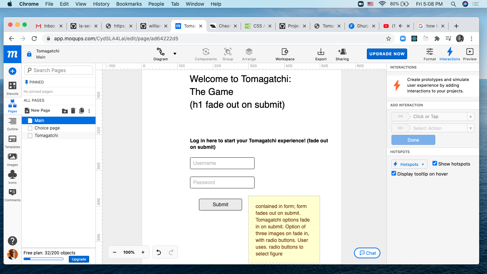
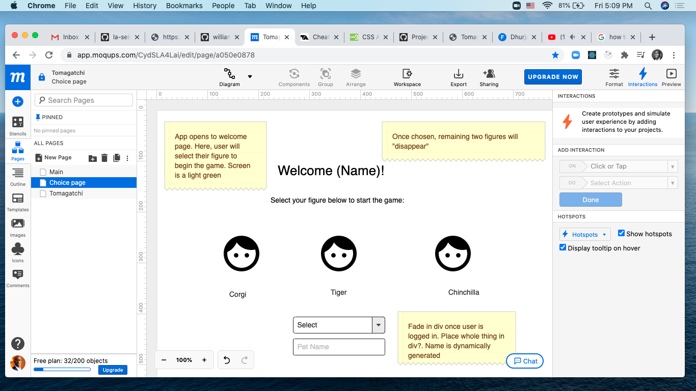
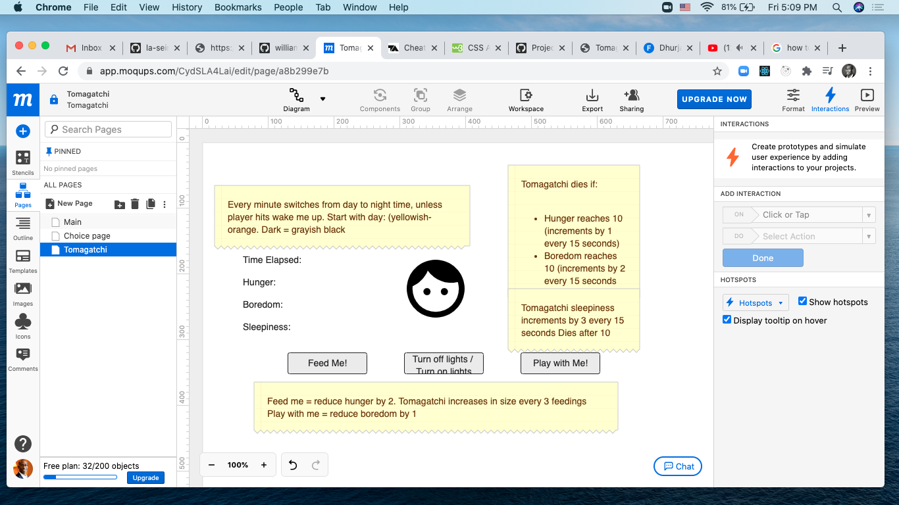

# tomagatchi

## User Story

As a teenager or otherwise casual game player who does not own a actual pet, out of fear of killing or it or not allowed to own a pet, I want to be able to own a virtual pet. I want to have a game that easy to play to pass time in between different activities, and easy instructions. Or perhaps due the pandemic, I am looking for a break from another Hulu or Netflix bingefest and something like playing with a virtual pet seems like a fun way to kill some time. Finally, I may simply feel some nostaglia for the 90's and enjoyed playing the classic digipet game. 

## Tomagatchi: The Game

In full functionality, Tomagatchi the game would allow the user to create a username, which becomes the person's name for the game and a password, so that noone else would mess with the user's pet.

Once logged in, the user will make a selection of which pet they want to use and give his/her pet a name. The user has a choice between three pet: a panda bear, a hamster, and a pet monkey.  

Once the pet and pet name are determined, the timer starts and the game begins. The user has the option to feed the pet, let the pet rest, or play with the pet.  Meantime, every 10 seconds: 
The hunger increases by one, 
The boredom increases by three, and 
Sleepiness increases by two. 

If the pet is not fed enough (reaches 10), is not given enough rest (reaches 10), or is not played with enough (reaches 10), the pet dies.  

The user has the opportunity to care for the pet by the following:

Pushing "Feed Me" reduces hunger by one,
Pushing "Play With Me" reduces boredom by two, and
Pushing "Let Me Rest" reduces sleepiness by two.

The user also has the opportunity to exercise the pet, which decreases boredom by two, but increases sleepiness and hunger by one.  Also, the user has the option to turn out the light for the pet during rest periods.  Finally, if the pet dies, the user has the option to restart the game.  

## Wireframes (Original)

## Technologies 

Frontend - HTML, CSS, JS

